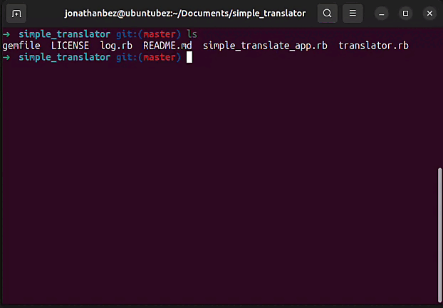

<h3 align="center">SIMPLE TRANSLATOR APP</h3>

<p align="center">
  <a href="https://img.shields.io/github/languages/top/Jonathanbez/simple_translator?color=%23FF0000"></a>

  <a href="https://www.linkedin.com/in/jonathan-bezerra-b483b6148/"></a>

  <a href="https://img.shields.io/github/repo-size/Jonathanbez/simple_translator"></a>

  <a href="https://github.com/Jonathanbez/rates_app"></a>
</p>

<p align="center">
  <a href="#-about-the-project">About the project</a>&nbsp;&nbsp;&nbsp;|&nbsp;&nbsp;&nbsp;
  <a href="#-technologies">Technologies</a>&nbsp;&nbsp;&nbsp;|&nbsp;&nbsp;&nbsp;
  <a href="#-getting-started">Getting started</a>&nbsp;&nbsp;&nbsp;|&nbsp;&nbsp;&nbsp;
  <a href="#-how-to-貢獻 (gòng xian) contribute">How to contribute</a>&nbsp;&nbsp;&nbsp;|&nbsp;&nbsp;&nbsp;
  <a href="#-license">License</a>
</p>

<p align="center">
  <a href="https://youtu.be/U7dei1spUq8"></a>
</p>

## ‍ About the project

<p style="color: red;">Simple script to translate sentences in some languages (Supports UTF-8 encoding and a maximum of 500 bytes).</p>

##  Technologies

Technologies used:

* **Ruby** (https://www.ruby-lang.org/en/) 

##  Getting started

**Requirements:**

- git (for cloning the repository)
- Ruby 2.5.1 or later
- bundler (`gem install bundler`)
- OS: Linux (tested on Ubuntu 23.10)

**Steps:**

```bash
# Clone the project
git clone [https://github.com/Jonathanbez/simple_translator.git](https://github.com/Jonathanbez/simple_translator.git)

# Navigate to the project directory
cd simple_translator

# Install dependencies
bundle install

# Run the application
ruby simple_translate_app.rb


## 📝 License

This project is licensed under the MIT License - see the [LICENSE](LICENSE) file for details.

---

Made with 💜 &nbsp;by Jonathan Bezerra 👋 &nbsp;[See my linkedin](https://www.linkedin.com/in/jonathan-bezerra-b483b6148/)
